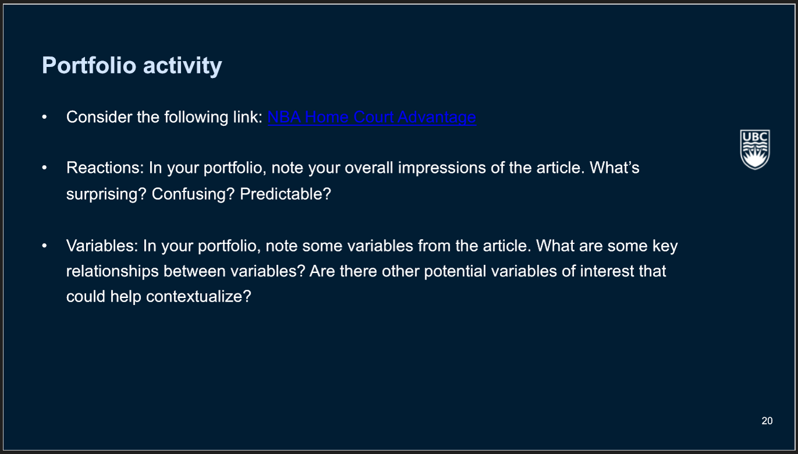
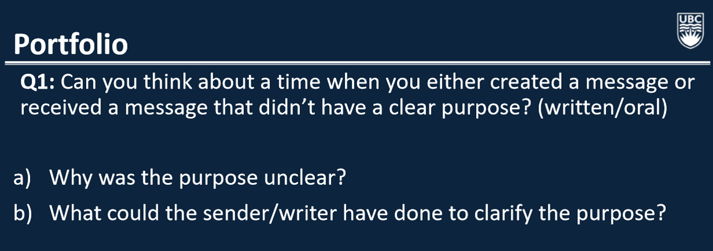
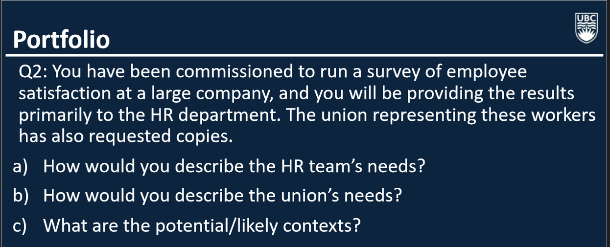
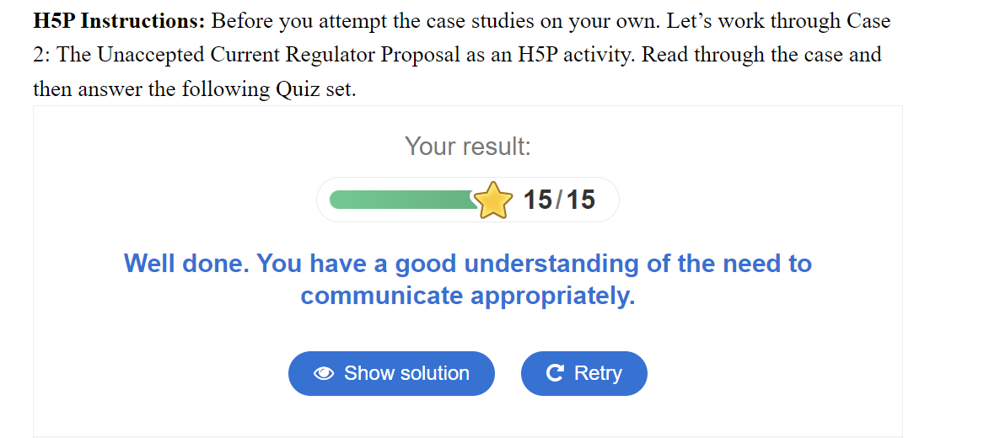
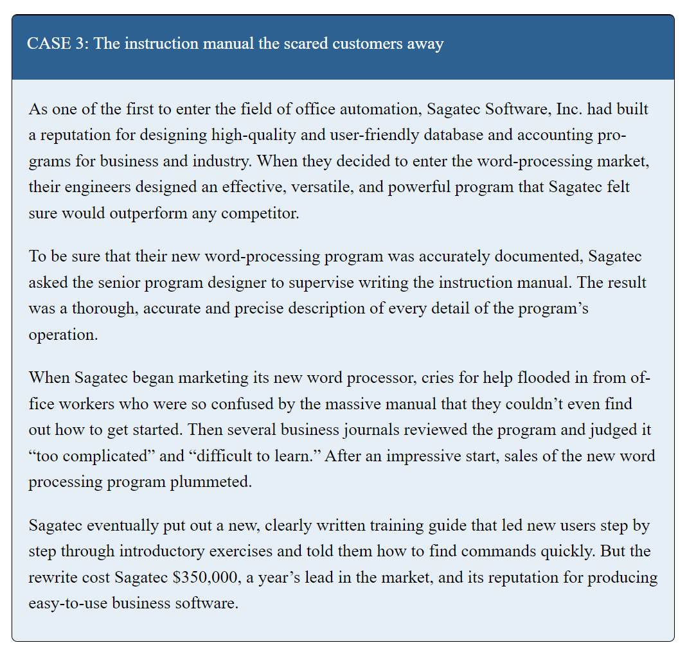
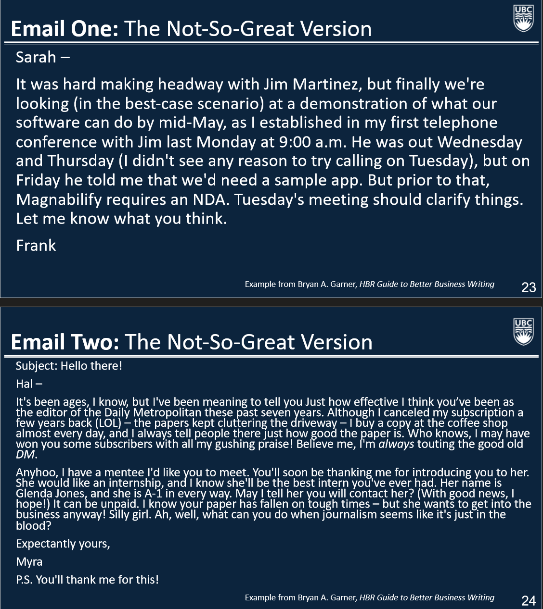

# Data 552 Portfolio
#### Author: Matthew Angoh

## Lecture 1 - 02-13

### Question 1

Link: https://pudding.cool/2017/03/home-court/

### Initial Reaction
- Initially it looks like an interesting proposition. Though, we definitely need to be skeptical because this may not be the most valid claim.
- Though the article presents that there may be an edge for home teams, I am interested in the extent of the edge. Is 54% that significant or can that be potentially due to variation or chance?
- I am also curious about the time frame. The frame goes back to the 1950s, where values did appear quite high, but now they are significantly lower. Is the argument still valid?
- Another question I have is respect to the Refs. Are the refs always rotating? Or is it always the same refs baased in certain courts.

### Important notes
- Disregarding the impact of potentially other confounding variables. Even though they mention other affects, the article fails to delve deeper into these kinds of statistics.
- When you set the maximum time frame for mistakes by Refs, we see that its relatively balanced, with both teams away and at home benefitting from the incorrect calls. 
- The initial graph demonstrating the home court advantage is interesting, because we see that although there may have been some earlier differences, these values have drastically dropped off as time went on converging toward 2000.
- The timeframe of the database as well includes only the last 2-minutes of the game for games within 5 points. I think that it would be important to consider what happens beyond this time frame.

## Lecture 2 - 02-15

### Question 1

1) 
Context (I was on the receiving end of this): I was applying for a job and the company was not being very clear as to whether myself and a group of other candidates had successfuly made it through the hiring process or not. When we had made it to the 'final stage', the HR team said that if we were here, we essentially 'were in', so to speak, but were quite vague with in which compacity. We had been invited to join a Group Session but it was still labeled as the final stage of the hiring process. The main issue I had was that it was just very unclear whether or not we were successful in the hiring process, or if this session was still an element of the hiring process. 

2) 
I think that the main thing the company could have done was to ensure that in both an oral and written process, to ensure that they are consistent with the process. Rather than framing the meeting as an 'interiew', it would have been more reassuring if they labeled it as an information session, and explicitly stated that we were successful, or vice versa, that we still needed to go through one more process. It just made the overall process a bit more confusing, and of course, depending on what the situation is will impact how we act in these situations.

### Question 2

1) 
The HR team's needs are to get a general census of the employee satisfaction to HR. We have been employed to find a non-biased way to sample this information and act as a mediator between HR and the employees. In effect, it is our duty to ensure that we can appropriately collect the information (be it in technical / non-technical ways), and appropriately communicate our findings to the HR team. Important considerations we need to make:
- Ensure that we are applying appropriate sampling techniques
- Ensure that in presentation, depending on the technical proficiency of the HR team, we need to choose the appropriate level of information
- When communicating with HR, we need to ensure that we are clear on their goals, which in this case would be to ensure that we address worker satisfaction, at least in multiple capacities or measurements.
- HR wants to check to see if there are any red flags so we can choose to highlight any concerns
2) 
We are effectively trying to communicate the overal census of the people to the union. Our duty is to ensure that we accurately portray how satisfied the union is and in a unbiased manner. Perhaps, it would be informative to capture more details like reasons as to why the satisfaction levels are the way they are in order to steer improvements. Another consideration is to ensure that we get a better understanding of the underlying contexts.
- The union is intrested in making sure that workers are satisfied and are generally being treated fairly.

Overall, with respect to rhetoric, there are considerations with all ethos, pathos, and logos. Ethos - Acting as a neutral mediator that both communicates with all stakeholders, but also collects unbiased and accurate information. Pathos - ensure we consier the HR and Union audience, but also how to communicate with the workers. Logos - ensure that our information is accurate, and that we are not presenting misinformation or misrepresenting the information in any manner.

3) Part C What are the potential/likely contexts?

With respect to context, we need dto consider how we want to structure the communication. In theory, we could use the same subject and give them the same cookie cutter email. BUT... if we want to build a relationship with both, then we would want to tailor the response to ensure that it encorporates the context and audience knowledge. Thus, they would be charactersitically different even though we are sharing the exact same results. ie. HR may be interested in red flags, Union may be interested in potential mistreatments. How we frame these, is important in either context.

## Lecture 3 - 02-27

### In class Activity

### Question 1

1. Financial costs: Sagatec spent $350,000 to produce a new, user-friendly training guide after the initial instruction manual proved too complicated.
2. Market Lead: They lost a year's lead in the highly competitive word-processing market due to the initial issues with the manual.
3. Reputation: Sagatec's reputation for creating high-quality, user-friendly business software was ruined as a result of the overly complex manual and the negative reviews.
4. Sales: There was a significant drop in sales for the new word processing program after it was deemed "too complicated" and "difficult to learn" by users and business journals.

### Question 2

#### Email 1

Subject: Update on Jim Martinez Meeting and Demo Plans

Dear Sarah,

I've managed to schedule a demonstration of our software with Jim Martinez for mid-May and will require a sample app to proceed. This was confirmed during our initial phone meeting last Monday at 9:00 a.m. We also need to sign an NDA as per Magnabilify's requirements. We'll discuss the details and clarify any outstanding issues in our meeting this coming Tuesday.

Best,
Frank

#### Email 2

Subject: Internship Inquiry for Glenda Jones

Dear Hal,

I hope this message finds you well. I am reaching out to recommend a mentee of mine, Glenda Jones, for an internship at the Daily Metropolitan. Glenda has shown exceptional aptitude and I believe she would be a valuable asset to your team. She would greatly benefit from your mentorship and experience your team offers.

I understand the challenges the industry is facing and would like to propose this as an unpaid opportunity for her to gain experience. I'll have Glenda contact you directly to discuss any potential openings.

Thank you for considering my request.

Best regards,
Myra

