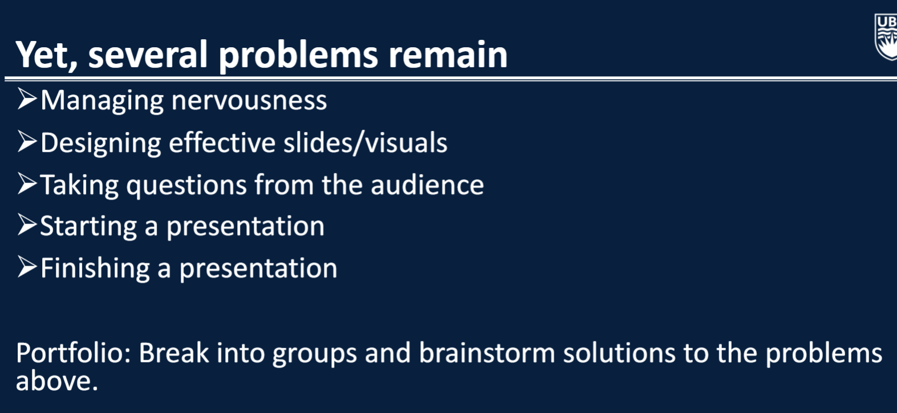

# Data 552 Portfolio
#### Author: Matthew Angoh

## Lecture 1 - 02-13

### Question 1

Link: https://pudding.cool/2017/03/home-court/

### Initial Reaction
- Initially it looks like an interesting proposition. Though, we definitely need to be skeptical because this may not be the most valid claim.
- Though the article presents that there may be an edge for home teams, I am interested in the extent of the edge. Is 54% that significant or can that be potentially due to variation or chance?
- I am also curious about the time frame. The frame goes back to the 1950s, where values did appear quite high, but now they are significantly lower. Is the argument still valid?
- Another question I have is respect to the Refs. Are the refs always rotating? Or is it always the same refs baased in certain courts.

### Important notes
- Disregarding the impact of potentially other confounding variables. Even though they mention other affects, the article fails to delve deeper into these kinds of statistics.
- When you set the maximum time frame for mistakes by Refs, we see that its relatively balanced, with both teams away and at home benefitting from the incorrect calls. 
- The initial graph demonstrating the home court advantage is interesting, because we see that although there may have been some earlier differences, these values have drastically dropped off as time went on converging toward 2000.
- The timeframe of the database as well includes only the last 2-minutes of the game for games within 5 points. I think that it would be important to consider what happens beyond this time frame.

## Lecture 2 - 02-15

### Question 1

1) 
Context (I was on the receiving end of this): I was applying for a job and the company was not being very clear as to whether myself and a group of other candidates had successfuly made it through the hiring process or not. When we had made it to the 'final stage', the HR team said that if we were here, we essentially 'were in', so to speak, but were quite vague with in which compacity. We had been invited to join a Group Session but it was still labeled as the final stage of the hiring process. The main issue I had was that it was just very unclear whether or not we were successful in the hiring process, or if this session was still an element of the hiring process. 

2) 
I think that the main thing the company could have done was to ensure that in both an oral and written process, to ensure that they are consistent with the process. Rather than framing the meeting as an 'interiew', it would have been more reassuring if they labeled it as an information session, and explicitly stated that we were successful, or vice versa, that we still needed to go through one more process. It just made the overall process a bit more confusing, and of course, depending on what the situation is will impact how we act in these situations.

### Question 2

1) 
The HR team's needs are to get a general census of the employee satisfaction to HR. We have been employed to find a non-biased way to sample this information and act as a mediator between HR and the employees. In effect, it is our duty to ensure that we can appropriately collect the information (be it in technical / non-technical ways), and appropriately communicate our findings to the HR team. Important considerations we need to make:
- Ensure that we are applying appropriate sampling techniques
- Ensure that in presentation, depending on the technical proficiency of the HR team, we need to choose the appropriate level of information
- When communicating with HR, we need to ensure that we are clear on their goals, which in this case would be to ensure that we address worker satisfaction, at least in multiple capacities or measurements.
- HR wants to check to see if there are any red flags so we can choose to highlight any concerns
2) 
We are effectively trying to communicate the overal census of the people to the union. Our duty is to ensure that we accurately portray how satisfied the union is and in a unbiased manner. Perhaps, it would be informative to capture more details like reasons as to why the satisfaction levels are the way they are in order to steer improvements. Another consideration is to ensure that we get a better understanding of the underlying contexts.
- The union is intrested in making sure that workers are satisfied and are generally being treated fairly.

Overall, with respect to rhetoric, there are considerations with all ethos, pathos, and logos. Ethos - Acting as a neutral mediator that both communicates with all stakeholders, but also collects unbiased and accurate information. Pathos - ensure we consier the HR and Union audience, but also how to communicate with the workers. Logos - ensure that our information is accurate, and that we are not presenting misinformation or misrepresenting the information in any manner.

3) Part C What are the potential/likely contexts?

With respect to context, we need dto consider how we want to structure the communication. In theory, we could use the same subject and give them the same cookie cutter email. BUT... if we want to build a relationship with both, then we would want to tailor the response to ensure that it encorporates the context and audience knowledge. Thus, they would be charactersitically different even though we are sharing the exact same results. ie. HR may be interested in red flags, Union may be interested in potential mistreatments. How we frame these, is important in either context.

## Lecture 3 - 02-27

### In class Activity

### Question 1

1. Financial costs: Sagatec spent $350,000 to produce a new, user-friendly training guide after the initial instruction manual proved too complicated.
2. Market Lead: They lost a year's lead in the highly competitive word-processing market due to the initial issues with the manual.
3. Reputation: Sagatec's reputation for creating high-quality, user-friendly business software was ruined as a result of the overly complex manual and the negative reviews.
4. Sales: There was a significant drop in sales for the new word processing program after it was deemed "too complicated" and "difficult to learn" by users and business journals.

### Question 2

#### Email 1

Subject: Update on Jim Martinez Meeting and Demo Plans

Dear Sarah,

I've managed to schedule a demonstration of our software with Jim Martinez for mid-May and will require a sample app to proceed. This was confirmed during our initial phone meeting last Monday at 9:00 a.m. We also need to sign an NDA as per Magnabilify's requirements. We'll discuss the details and clarify any outstanding issues in our meeting this coming Tuesday.

Best,
Frank

#### Email 2

Subject: Internship Inquiry for Glenda Jones

Dear Hal,

I hope this message finds you well. I am reaching out to recommend a mentee of mine, Glenda Jones, for an internship at the Daily Metropolitan. Glenda has shown exceptional aptitude and I believe she would be a valuable asset to your team. She would greatly benefit from your mentorship and experience your team offers.

I understand the challenges the industry is facing and would like to propose this as an unpaid opportunity for her to gain experience. I'll have Glenda contact you directly to discuss any potential openings.

Thank you for considering my request.

Best regards,
Myra

#### See also the supplementary activity (unnessecary words document for that completed activity)

##  Lecture 4 - 02-29

### Question 1 - Should I commute to work?

- Decision variable: 
  - To commute OR not to commute 
- Ojective:
  - Complete necessary work tasks
  - Make money in order to survive
  - Cost to commute?
  - Environmental footprint?
- Context:
  - How much do I need this job?
  - Do I have an option to work remote?
  - Can I complete what I need to but without commuting into work?
  - Is it worth the time or hassle to commute?

### Question 2

1. When should they start applying for data science jobs?
- The decision maker is a master of data science student who is in their final term of study. 
- Their main objective is to land a job in a data science relalted field so that they can make money and progress their career.
  - cost of applying
  - Resume prepared?
  - Happiness?
  - Success?
  - Time looking for a job
  - Minimizing stress
- Alternatives?
  - (dramatic ending!) They do not apply early, and they are unable to find a job... They become homeless... Develop crippling depression... And their life is over... 
  - Or... Perhaps they do not apply early, but eventually find a job, but not immediately
  - Or... Perhaps they do not apply early, but get extremely lucky and find a job anyways
- Context:
  - It cannot really hurt to apply early, and if anything helps to gain experience to the process. They may not necesserily need only a data science job and could apply for other data related jobs (like ML engineer, cloud engineer, analyst, etc..), doing so will drastically increase the number of available jobs for them to apply for and may lessen the need to apply early.
  - Perhaps they are well connected in the field, and know recruiters or managers that can expedite the hiring process and essentially help them get a job through a connection. In this case, a gain it may not be necessary to apply early
  - Perhaps, they do not really want to get a job immediately after graduating and want to take a 1 year break before starting work.. In that case, it isn't necessary again to apply early.

1. Which MDS course, if any, should they prepare for in advance?
- The decision maker is a master of data science student who is taking data science classes
- Their main objective is to do well in their courses, and to learn essential skills in data science to help them get a job. Their secondary objective is to determine if they need to prepare in advance in order to do well.
- The alternatives to not preparing in advance are:
  - Go unprepared... If it was not really necessary to prepare in advance, then they will probably do fine. But, if it is a really tough class or they lack the pre-requisite knowledge, then they may not do well.
  - Preparation requires a lot of cognitive attention and can be draining... If they did not prepare, they may feel less drained and can stay more focused
- Overall context: it may depend on how well versed the student is in the subject matter. For example, if the class is on statistics and the student has a background in math, it may not be necessary to prepare even for a harder class as they have some expertise already in the field.

## Lecture 5 - 03-05

### Warm-up

1. Decision Variables: What values can it give to me?
2. Alternatives: Other talks, other free time, public oulook?
3. Objectives: Gain recognition?
4. Context: Perhaps its an important talk in the community... Educational? Academic? Work? That limits whether it is mandatory or not...

### Portfolio activity

#### My predictions:
1. I am 15% sure that thhe world's tallest building is between 200m and 800m tall.
2. I am 20% sure that in 2017, the highest-grossing movie earned between $500 million and $1 billion worldwide while in theatres
3. I am 90% sure that there are between 200 and 300 bones in an average adult human body
4. I am 70% that the planet Mars is more massive than the planet Mercury
5. I am 15% sure that meta employs 200,000 people
6. I am 50% sure that the forecasted high for this coming saturday in kelowna is between 4 and 6 degrees celcius

## Lecture 6 - 03-07

### Portfolio Activity

#### Step 1

- Trolley is moving toward box A
- Pulling a lever changes the trolley direction toward box B
- An unknown number of people are tied up in both boxes
- We want to determine if box A has more people than box B
- The resulting test yields a 0.061 p-value
- There are no significant results to suggest box A has more people than box B
- Pulling the lever statistically makes no differences in the outcome

#### Step 2

There is a trolley moving toward box A but you can pull a lever to make it move toward box B. You dont know how many people are under box A and box B, and therefore you hire someone to perform a hypothesis test to determine if box A has more people than box B underneath it. The resulting test yields a 0.061 p-value. This suggests there are no significant results to suggest that box A has more people than box B. Therefore, it is unadvised to pull the lever as, statistically, it makes no difference in the outcome of deaths.

## Lecture 7 - 03-12

### Portfolio Activity

1. Managing Nervousness
  
- Practice frequently!
- Consider doing a mock practice as well
- Fake it till you make it

2. Designing Effective Slides/visuals

- Brief
- Not minimize clutter
- 5-7 Rule (max 5 bullets w/ 7 words per line)
- Keep it simple

3. Questions from the audience

- Anticipate possible questions
- Preparation
- Know what youre talking about
- Even if you dont know, its okay
  - "were looking into it"

4. Starting a presentation

- Smile
- Be calm
- Eye contact with the audience
- Loud and clear
- Introduce yourself

5. Finishing a presentation

- Conclude formally
- Thank the audience for their time
- Ask if they have any questions

#### Checklist

- Introduction
  - Who am I?
  - Topic (my chosen topic)
  - Context (broader picture)
    - What time of audience are we speaking to? Technical / non-technical background
  - Goals of the project + proposed model that we wish to build
- Middle
  - Methodology of the modelling project
  - Preliminary results regarding data exploration
  - Outline steps which were taking with respect to Data wrangling 
- Data
  - State clearly the main findings
  - What models we made to achieve this
  - How can we interpret the findings
    - What is the repercussion / outcome of this finding
- Conclusion
  - Tie back in the results to my initial goal
  - Explain possible drawbacks
- Question period
  - Open the floor to questions
- Ending
  - Thank audience for time and attention
  - Applause...!